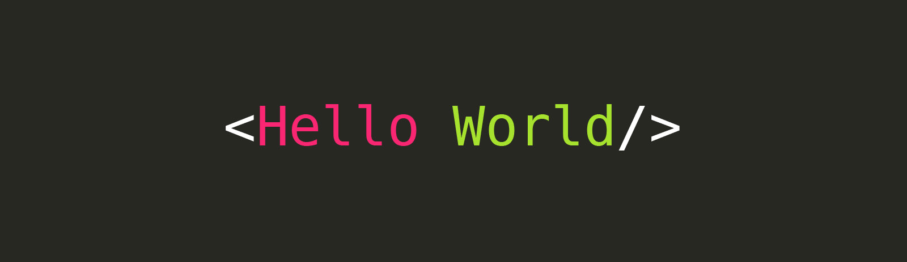
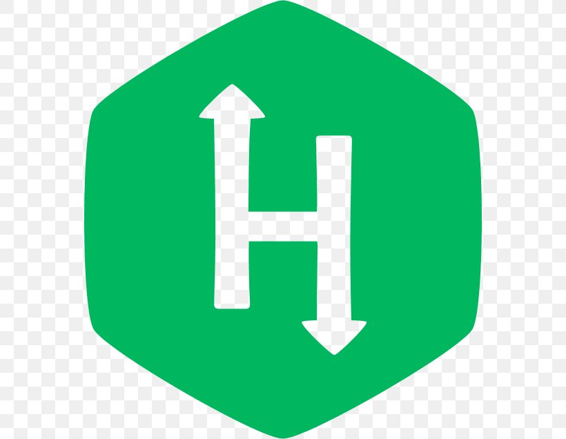

<a href="#" style="text-align:center;">

</a>

<h1 align="center">Hi , I'm Saurav</h1>
<h3 align="center">An Aspiring Software Developer.</h3>

## 🙋‍♂️ About Me

- 🎓 I'm currently pursuing Bachelor's in Computer Engineering from Government Engineering College Rajkot.

- 🌱 I’m currently improving my **Data Structures and Algorithms** skills.

- 👯 I’m looking to collaborate on **OpenSource Projects.**

- 👨‍💻 I also have interest in **Competitve Programming** and **Full stack web Development**.

- 📧 Contact me : **saurav.sutaria02@gmail.com**

## 🚀 Languages and Tools:

 
    
    
     
     
     
    
      

## 🌟 Online Coding Profiles:

## 📍 Connect with me:

## 📊 My Github Stats

<!--       -->
 

    

   
    
  
   
  <b>Note:</b> Top languages is only a metric of the languages my public code consists of and doesn't reflect experience or skill level.

 
 

## ❤ Views and Followers

****
